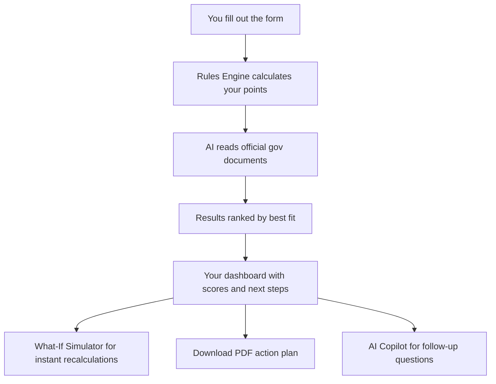

# Borderless AI — Your Immigration Advisor

**Find out which visa you qualify for — in 2 minutes, for free.**

Borderless AI helps people who want to move, work, or study abroad. You tell us about yourself, and we tell you which countries and visa options actually fit your profile — with clear scores, honest answers, and real government sources.

> ⚠️ **Not legal advice.** This is an AI tool to help you understand your options. Always consult a licensed immigration lawyer before making big decisions.

---

## 🌍 What Does It Do?

Most people who want to immigrate don't know where to start. Immigration rules are complicated, change often, and are different for every country. Hiring a lawyer just to understand your options can cost thousands of dollars.

**Borderless AI gives you a free starting point.** It checks your profile against real visa rules from 70+ countries and tells you:
- Which visas you likely qualify for
- What's blocking you (and how to fix it)
- What score you'd get under Canada's points system, Germany's Chancenkarte, the UK Skilled Worker visa, and many more
- What to improve to boost your chances

---

## 🎯 Key Features

### 1. 📋 Visa Assessment Form (`/form`)
Fill out a short form — your nationality, age, education, work experience, English score, and savings. Takes about 2 minutes.

The system then checks your profile against real government visa rules and shows you the top visa options that fit you.

### 2. 📊 Results Dashboard (`/results`)
After the assessment, you get:
- A score (0–100) for each visa option
- What requirements you meet ✅ and what's missing ❌
- The exact points breakdown (e.g. *"Master's degree: +12 points"*)
- Tips on what to improve to increase your score

### 3. 🤖 AI Chat Copilot (`/chat`)
Ask any visa question in plain English. The AI answers using real government documents — not guesswork. It tells you which sources it used so you can verify the answer yourself.

You get **3 free chats** as a guest. Pro users get unlimited.

### 4. 🌐 Explore All Pathways (`/explore`)
Browse **1,454 visa routes** across 70+ countries. Filter by:
- Goal (work, study, startup, digital nomad, permanent residency)
- Budget
- How fast you can get it
- How competitive it is

Each result links directly to the official government website.

### 5. 🔢 What-If Simulator
On your results page, you can adjust things like your English score or savings and instantly see how your score changes — no need to re-submit the form. Answers appear instantly.

### 6. 📄 Download Your Action Plan
Get a personalized PDF with your top visa options, what documents you need, and your next steps — ready to share with a lawyer or family member.

### 7. 👤 Personal Dashboard (`/dashboard`)
Sign in to see all your past assessments, how your profile compares to other applicants, and track your progress over time.

---

## 🌐 Countries Covered (70+)

| Region | Countries |
|---|---|
| **North America** | 🇨🇦 Canada (Express Entry, PNP, Startup Visa) |
| **Europe** | 🇩🇪 Germany, 🇵🇹 Portugal, 🇪🇸 Spain, 🇮🇹 Italy, 🇳🇱 Netherlands + EU Blue Card |
| **United Kingdom** | 🇬🇧 UK (Skilled Worker, Global Talent, Scale-up) |
| **Oceania** | 🇦🇺 Australia, 🇳🇿 New Zealand |
| **Middle East** | 🇦🇪 UAE, 🇸🇦 Saudi Arabia |
| **United States** | 🇺🇸 O-1, H-1B, L-1, EB-1, EB-2 NIW |
| **Asia** | 🇸🇬 Singapore, 🇲🇾 Malaysia, 🇯🇵 Japan, 🇰🇷 South Korea |
| **Latin America** | 🇲🇽 Mexico, 🇨🇴 Colombia, 🇨🇷 Costa Rica, 🇵🇦 Panama |

---

## 📊 What Do the Scores Mean?

| Score | What It Means |
|---|---|
| **0 – 29** | Very unlikely. You'd need major changes to qualify. |
| **30 – 49** | Weak match. Some indirect routes may be possible (e.g. study first, then work). |
| **50 – 69** | Possible, but there's competition. You meet some criteria but not all. |
| **70 – 85** | Strong match. Very realistic under current rules. |
| **86 – 100** | Exceptional profile. Very few people reach this range. |

---

## 💰 Pricing

| Plan | Price | What You Get |
|---|---|---|
| **Free** | $0 | 5 assessments/month, 3 AI chat messages, unlimited Explorer |
| **Pro** | $9/month | Unlimited assessments + unlimited AI chat |

---

## 🚀 Try It Now

**Live App:** [https://borderless.ghulam-mustafa.com](https://borderless.ghulam-mustafa.com)

Or try it locally:

```bash
# 1. Clone the project
git clone https://github.com/GhulamMustufa/borderless-ai.git
cd borderless-ai

# 2. Install packages
npm install

# 3. Set up your environment variables (copy from .env.example)
cp .env.example .env
# Then fill in your keys (Clerk, OpenAI, database URL)

# 4. Start the app
npm run dev
# Opens at http://localhost:3000
```

### Required environment variables:
```
NEXT_PUBLIC_CLERK_PUBLISHABLE_KEY=   # From clerk.com
CLERK_SECRET_KEY=                    # From clerk.com
OPENAI_API_KEY=                      # From platform.openai.com
DATABASE_URL=                        # PostgreSQL connection string (Neon works great)
STRIPE_SECRET_KEY=                   # From stripe.com (for Pro plan)
```

---

## 🧠 How It Works (Simple Version)

1. **You fill out the form** → We collect your profile (age, education, job, English level, savings)
2. **We run the rules** → Our system checks real government immigration rules and calculates exact points
3. **AI reviews it** → The AI reads official government documents and adds context, explanations, and next steps
4. **You get results** → A ranked list of your best visa options with honest scores and sources

The AI **never makes up scores**. All points are calculated using real, fixed government rules. The AI only helps explain what the numbers mean.

---

## 🛡️ Is It Safe and Honest?

Yes. Here's what we do to make sure:

- **Real sources only** — All answers are backed by official government websites (`.gov`, `.gc.ca`, `.gov.uk`, etc.)
- **No made-up scores** — Points are calculated using fixed mathematical rules, not AI guesses
- **We tell you what we don't know** — If we're not sure about something, we say so
- **Clear disclaimer** — This is NOT legal advice. It's a research and planning tool

---

## 🏗️ Architecture Overview



**Tech used:** Next.js 14, TypeScript, Tailwind CSS, OpenAI, PostgreSQL (with vector search), Clerk Auth, Stripe, Vercel

---

## 📚 More Documentation

- [How the AI Works](docs/AI-ARCHITECTURE.md)
- [How Scores Are Calculated](docs/SCORING-METHODOLOGY.md)
- [All Visa Pathways & Data](docs/PRODUCT.md)
- [API Reference](docs/API.md)

---

## 👥 Contributing

Pull requests are welcome! Please read the [coding standards](docs/CODING_STANDARDS.md) before contributing.

---

*Built to make immigration research accessible to everyone — not just those who can afford a lawyer.*
