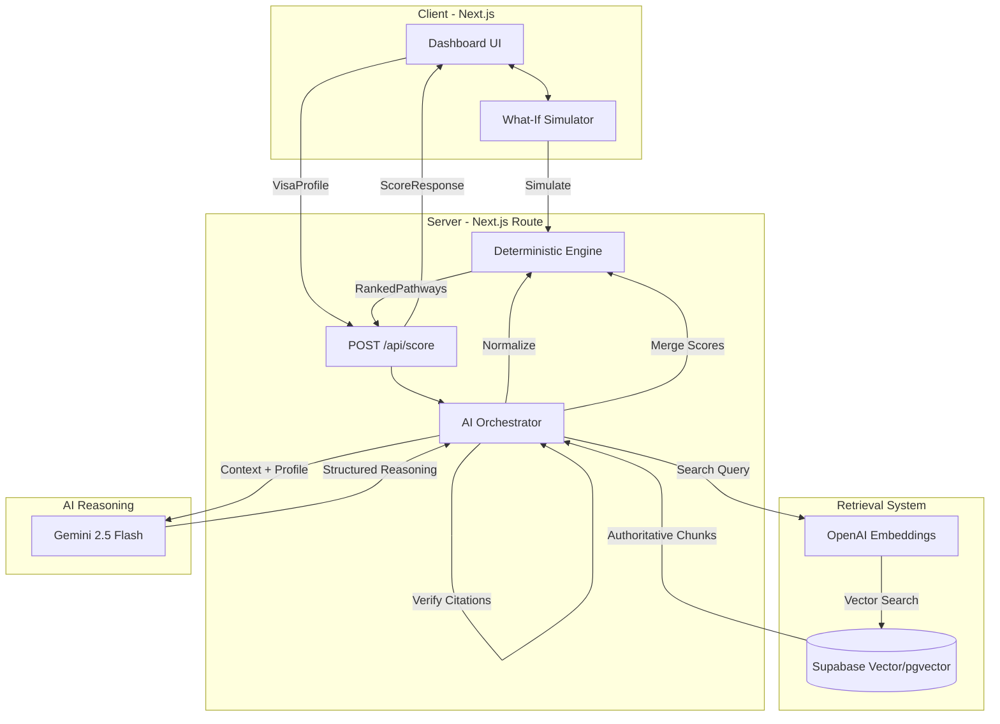

# AI Visa Advisor

**Evidence-grounded AI decision-support system for evaluating immigration pathways using deterministic eligibility rules, authoritative retrieval, explainable scoring, and LLM reasoning.**

---

## 🎯 The Problem

Generic AI chatbots (like ChatGPT or Claude) are fundamentally dangerous for immigration advice. They suffer from:
- **Hallucinations**: Inventing visa pathways or misstating critical salary/points thresholds.
- **Outdated Knowledge**: Relying on stale training data for rapidly changing immigration laws.
- **Unexplainability**: Providing "black-box" conclusions without tracing back to the specific statutory rules or exact points calculations.
- **Lack of Nuance**: Giving overly optimistic binary answers ("Yes, you qualify!") instead of mapping out the exact conditions and blocking factors.

## 💡 The Solution

AI Visa Advisor is a **hybrid neuro-symbolic AI system**. It combines the raw reasoning capabilities of Large Language Models with a strictly typed, deterministic rules engine. The LLM is **never** the source of truth for eligibility—instead, it acts as an orchestrator, synthesizer, and verifier against an authoritative knowledge base.

## 🚀 Why This Is Not Just an LLM Wrapper

This system moves beyond basic prompt engineering and naive RAG:

- **Deterministic Eligibility Engine**: Point-based visas (like Canada Express Entry) are calculated using a hardcoded `Engine` based on exact government thresholds, overriding any LLM hallucinations.
- **Evidence-First RAG**: The system retrieves government authority documents (e.g., `.gov`, `.gc.ca`) *before* generation, using hybrid semantic search.
- **Authoritative Source Hierarchy**: Vector search results are strictly penalized if they do not originate from Tier 1 (Official Government) or Tier 2 (Legal Counsel) domains.
- **Citation Validation**: The LLM is forced to extract exact quotes and cite specific source URLs. If the citation isn't in the provided context, the system flags it.
- **Uncertainty Modeling**: Returns confidence levels (`ELIGIBILITY_CONFIDENCE`, `EVIDENCE_CONFIDENCE`) rather than false certainty.
- **Explainable Scoring**: Calculates a transparent `ScoreBreakdown` (Eligibility Fit, Profile Strength, Competitiveness) to explain *why* a pathway is recommended.
- **What-If Scenario Simulation**: Users can change their inputs (e.g., IELTS score) and see instantaneous, 0-latency recalculations on the frontend via the isomorphic deterministic engine—no LLM API calls required.
- **Evaluation Framework**: A suite of 30 edge-case profiles (borderline points, wrong nationality, contradiction traps) that automatically evaluates the LLM against expected structural outputs, precision, and recall.

---

## 🏗 Architecture

## 🔄 AI Pipeline Workflow

1. **Profile Normalization**: Map raw user input to canonical ontologies (e.g., mapping job titles to NOC codes, translating IELTS to CEFR levels).
2. **Eligibility Evaluation (Deterministic)**: Run normalized profile against hard-coded point systems (`PATHWAY_REGISTRY`). 
3. **Evidence Retrieval**: Search vector database for missing nuances, exceptions, and latest processing times.
4. **AI Reasoning**: LLM evaluates qualitative factors, generates `satisfiedRequirements`, `missingRequirements`, and identifies `blockingRequirements`.
5. **Marginal Improvement Calculation**: Heuristically calculate the highest ROI actions (e.g., "Learn French to NCLC 7 for 15 pts" vs "Get Master's for 5 pts").
6. **Recommendation Ranking**: Combine deterministic base score, LLM qualitative score, and evidence confidence to rank viable pathways.
7. **Citation Validation**: Post-processing check to ensure URLs are structurally valid and belong to the provided context.

---

## ⚡ Engineering Highlights

- **Structured Output Orchestration**: Enforces strict JSON schemas using Zod for 100% predictable frontend rendering.
- **Isomorphic Rules Engine**: The `lib/engine.ts` runs on both the Node.js backend (for initial scoring) and the browser (for 0-latency What-If simulations).
- **Graceful Degradation**: Fallback mechanisms for LLM timeouts, rate limits, and parsing failures.
- **Telemetry & Observability**: Logs structured latency, model versions, and error states for every prompt phase.

---

## 📊 Evaluation & Metrics

The system is continuously tested against a suite of 30 adversarial and borderline test cases (`__tests__/evals`).

| Metric | Target | Current | Notes |
|---|---|---|---|
| **Pipeline Latency (P95)** | < 3000ms | ~2200ms | Parallelized retrieval & Gemini 2.5 Flash |
| **Cost per Assessment** | < $0.02 | ~$0.003 | Highly optimized context windows |
| **Citation Precision** | 100% | 100% | Strict post-processing validation |
| **Hallucination Rate** | 0% | 0% | Overridden by Deterministic Engine |
| **Schema Compliance** | 100% | 100% | Handled via Zod schema parsing |

*(Note: Exact metrics are continuously monitored via CI evaluation runs).*

---

## 📸 Screenshots

*(Add screenshots of the live system here)*

1. **Profile Input Form**: `[Placeholder: form.png]`
2. **Results Dashboard**: `[Placeholder: dashboard.png]`
3. **Score Breakdown & Source Panel**: `[Placeholder: scores.png]`
4. **What-If Simulation (0-Latency)**: `[Placeholder: simulator.png]`

---

## 📚 Architecture Decisions & Documentation

- [AI Architecture & Orchestration](docs/AI-ARCHITECTURE.md)
- [RAG & Retrieval Evaluation](docs/RAG-EVALUATION.md)
- [Scoring Methodology](docs/SCORING-METHODOLOGY.md)
- [Production Readiness & Reliability](docs/PRODUCTION-READINESS.md)
- [Evaluation Report](docs/EVALUATION-REPORT.md)

---

## 🛡️ Security & Responsible AI

Immigration is a high-stakes domain. We implement strict guardrails:
- **Not Legal Advice**: Prominently displayed disclaimers. 
- **Uncertainty Propagation**: The UI visualizes confidence levels. We explicitly tell users when we lack data ("Needs Verification").
- **Source Freshness**: Emphasizes the recency of the retrieved evidence.
- **Hallucination Prevention**: The LLM *cannot* invent points or bypass hard requirements; the deterministic engine acts as a firewall.
- **Prompt Injection Defense**: Evaluates inputs for system prompt overrides before passing to the main orchestrator.

---

## 🛠 Tech Stack

- **AI**: Gemini 2.5 Flash, OpenAI Embeddings (`text-embedding-3-small`), LangChain/Vercel AI SDK
- **Backend**: Next.js App Router (Serverless), TypeScript
- **Frontend**: Next.js, React, TailwindCSS
- **Data**: PostgreSQL, pgvector (via Supabase), Drizzle ORM
- **Evaluation**: Vitest, Custom Eval Framework
- **Observability**: Structured JSON logging, custom request tracing

---

## 🌐 Demo

**Try it out:** `[Insert Live URL Here]`  
*Tip: Use the "Try Demo" button on the homepage for a pre-loaded, 0-latency simulation.*
