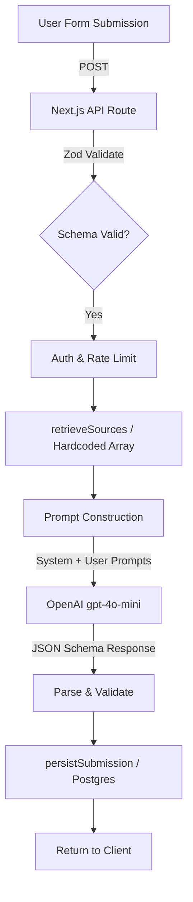
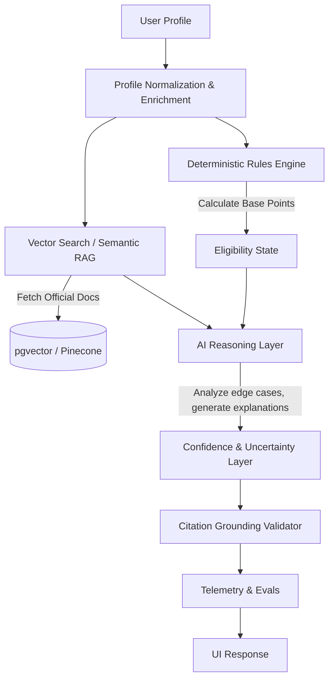

# Technical Architecture Audit: Borderless AI

## 1. Current Architecture

The current application operates as a single-shot Next.js API wrapper around OpenAI.

### Request Flow
1. **User** accesses the Next.js frontend (`/form`) and submits their profile.
2. **Next.js API Route** (`app/api/score/route.ts`) receives the payload.
3. **Validation & Auth**: Zod validates the schema, `checkRateLimit` verifies IP limits, and Supabase auth checks Stripe subscriptions.
4. **Retrieval**: The profile is passed to `retrieveSources` in `lib/rag.ts`. 
5. **Prompt Construction**: A strict system prompt and user prompt are concatenated with the profile JSON and the retrieved sources.
6. **LLM Invocation**: A single call is made to `gpt-4o-mini` using OpenAI's `json_schema` response format.
7. **Parsing**: The structured output is validated via a lightweight parsing function.
8. **Persistence**: The raw request, response, latency, and model info are saved to PostgreSQL via `lib/persistence.ts`.
9. **UI**: The client renders the JSON payload.

### Mermaid Diagram

## 2. Current AI Architecture Classification

A close inspection reveals that the system is heavily reliant on the LLM for core business logic rather than using the LLM for what it does best.

* **LLM Reasoning**: Heavily overloaded. The LLM is tasked with calculating a numerical score out of 100, identifying score drivers, and recommending pathways in a single shot.
* **Retrieval**: **Pseudo-RAG**. `lib/rag.ts` is simply an array of 17 hard-coded Javascript objects. Retrieval is done via basic string matching (`goal.includes("work") && /work|labor/i.test(doc.summary)`).
* **Prompt Engineering**: Highly prescriptive single prompt with some basic dynamic heuristics (e.g., classifying a profile as `strict` or `balanced` based on hardcoded weaknesses).
* **Deterministic Logic**: Almost entirely absent in the active critical path. There is a fully written deterministic scoring engine in `lib/score.ts`, but it is **unused/dead code**. The active API route asks the LLM to hallucinate points.
* **Scoring**: Arbitrary probability generation. The LLM invents "+12pts" based on prompt vibes.
* **Validation**: OpenAI's structured output natively enforces the schema shape.
* **Source Grounding**: The LLM is instructed to use the provided 17 sources, but there is no mechanism verifying the citations actually align with the text.
* **Recommendation Generation**: Purely generative, single-shot.

## 3. Strengths

1. **Structured Outputs**: Leveraging OpenAI's `json_schema` for guaranteed output shapes is the correct, modern approach for application integration.
2. **Type Safety**: Zod schemas and TypeScript interfaces provide a strong data contract.
3. **Resilience**: The API route includes built-in retry logic (`withRetry`) and timeouts (`AbortController`).
4. **Basic Telemetry**: `visa_submissions` accurately logs latency, prompt versions, and models.
5. **Modern Stack**: Next.js App Router, Supabase, and Tailwind make a strong foundation for scaling the product.

## 4. Weaknesses (The Brutal Reality)

The current system is a "thin wrapper" that masquerades as an AI product. It is highly susceptible to hallucinations and provides arbitrary numerical outputs disguised as data science.

* **Arbitrary Probability Scoring (Critical Risk)**: The LLM generates the score and the "score drivers" (e.g., "Master's degree: +12pts") dynamically. This means a user could submit the same profile twice and receive completely different points breakdowns. This destroys trust and legal credibility.
* **Dead Deterministic Code**: `lib/score.ts` contains a deterministic scoring engine that isn't connected to the main API route.
* **Fake RAG (Hard-coded Knowledge)**: `lib/rag.ts` contains 17 static text blocks. This is not RAG; it is hard-coded prompt injection. It will rot as immigration laws change.
* **LLM Over-reliance**: The LLM is acting as a database, a rules engine, and a calculator simultaneously.
* **Missing Observability**: While Postgres logs the final result, there is no tracing of LLM reasoning steps, latency breakdowns, or token usage (e.g., via Langfuse/Braintrust).
* **Zero Evaluation Pipeline**: There are no automated tests evaluating the LLM's hallucination rate, citation accuracy, or adherence to official guidelines.
* **Misleading UX**: The UI claims the score is "grounded in official government sources," which gives users a false sense of security regarding the hallucinated LLM score.
* **Single-Shot Reasoning**: The LLM has no room to "think" deeply before generating the final JSON. While there is a `_thinking` field, it is artificially constrained to <300 characters.

## 5. AI Engineering Maturity Score: 38 / 100

* **AI Architecture (20/100)**: Using an LLM as a calculator/rules-engine is an anti-pattern.
* **RAG (10/100)**: Hardcoded array with `RegExp.test()` is not RAG.
* **Agentic Reasoning (10/100)**: Single-shot prompt. No tool use, no reflection.
* **Evaluation (0/100)**: Completely absent.
* **Reliability (70/100)**: Code-level reliability (retries, timeouts, schemas) is actually very strong.
* **Explainability (20/100)**: The LLM invents the explanation post-hoc to justify the arbitrary score it generated.
* **Security (60/100)**: Rate limiting and auth are present, but prompt injection defenses are missing.
* **Production Engineering (70/100)**: Solid Next.js and Supabase implementation.
* **Observability (40/100)**: Database logging exists, but lacks LLM-specific tracing.
* **UX (70/100)**: Beautiful interface, but slightly deceptive regarding AI capabilities.
* **Documentation (10/100)**: Missing architectural records or system context docs.

## 6. Target Architecture

We must invert the control: **Deterministic systems should score, rank, and filter. AI should analyze nuance, explain the score, and extract evidence.**

1. **Eligibility Engine**: Use a robust version of `lib/score.ts` to calculate real points based on real rules.
2. **AI Reasoning**: The LLM receives the *deterministic score* and the *retrieved context*, and is asked to explain it, identify gaps, and handle edge cases (e.g., "This score assumes your degree is recognized by WES").
3. **Semantic RAG**: A real vector database pipeline that ingests RSS feeds or official updates from IRCC/USCIS.

## 7. Architecture Decision Records (ADRs) to Implement

* **ADR-001: Deterministic Scoring vs. Generative Scoring**: Why we must use standard code for points-based immigration logic, relegating the LLM to explanation and unstructured analysis.
* **ADR-002: Separation of Retrieval (Vector) and Generation**: Why `lib/rag.ts` must be deprecated in favor of `pgvector` or an external vector store.
* **ADR-003: LLM Observability & Tracing**: The decision to implement Langfuse or Braintrust for monitoring token usage, latency, and prompt versioning.
* **ADR-004: Automated Evals (LLM-as-a-Judge)**: Establishing a pipeline to automatically test citation accuracy and hallucination rates before deploying new prompts.

## 8. Priority Matrix

| Rec # | Problem | Proposed Solution | Eng. Complexity | Value (AI/Recruiter) | Risk if omitted |
|-------|---------|-------------------|-----------------|----------------------|-----------------|
| **P0** | Arbitrary LLM scoring | Wire up `lib/score.ts` deterministic engine. Pass score to LLM for explanation. | Medium | Extremely High | Total loss of trust/credibility |
| **P0** | Fake RAG | Implement real vector database (e.g., Supabase pgvector) and semantic search. | High | Extremely High | Hard-coded data rots rapidly |
| **P1** | No Observability | Integrate Langfuse or Braintrust to trace LLM calls, latency, and costs. | Low | High | Blind to production AI failures |
| **P1** | No Evals | Add an evaluation suite (e.g., Promptfoo) to test hallucination rates against a golden dataset. | Medium | High | Regressions on prompt updates |
| **P2** | Weak Prompting | Convert single-shot prompt into a Chain-of-Thought or multi-step agentic flow. | Medium | Medium | Sub-optimal reasoning |
| **P3** | Stale Source Data | Build a scheduled ingestion pipeline (cron) for official immigration websites. | High | Low | Manual database updates required |

## 9. Top 10 Improvements for Maximum Perceived Maturity

1. **Deterministic Core**: Move the actual scoring out of the LLM and into TypeScript.
2. **pgvector Integration**: Replace the `SOURCES` array with semantic embeddings.
3. **AI Observability**: Show you know how to trace LLM execution in production (Langfuse).
4. **Golden Dataset Evals**: Show you know how to measure AI quality, not just ship it.
5. **Chain of Thought Refactoring**: Force the LLM to explicitly reason before outputting the final JSON.
6. **Citation Verification**: Add a validation step that ensures generated citations match retrieved source URLs exactly.
7. **Uncertainty Modeling**: Add a `confidence_score` and `uncertainty_factors` to the JSON schema to demonstrate responsible AI.
8. **Dynamic Prompt Injection Defenses**: Add sanitization for user inputs (like `fieldOfWork`).
9. **Streaming Architecture**: Implement streaming for the `_thinking` and `reason` fields to improve perceived latency.
10. **Data Pipeline Architecture**: Document how the vector DB is populated asynchronously.

## 10. Implementation Roadmap

*"If I had only 20 hours to make this project significantly stronger, I would implement these exact items in this order:"*

1. **Hour 1-4: The Deterministic Pivot (P0)**
   * Strip scoring out of the OpenAI prompt.
   * Wire `app/api/score/route.ts` to call `computeVisaScore()` from `lib/score.ts`.
   * Pass the deterministic options into the LLM as ground truth, asking the LLM *only* to generate the human-readable explanation, weaknesses, and timeline.

2. **Hour 5-8: Real RAG implementation (P0)**
   * Enable `pgvector` on the Supabase instance.
   * Write a quick script to embed the 17 sources (using `text-embedding-3-small`) into the database.
   * Update `lib/rag.ts` to perform a real cosine-similarity search based on the user's profile text.

3. **Hour 9-12: AI Observability (P1)**
   * Add Langfuse (or similar) wrappers to the OpenAI call.
   * Ensure user IDs, latency, and generations are logged to a dashboard. This is instant recruiter eye-candy.

4. **Hour 13-16: Evaluation Suite (P1)**
   * Create a `__tests__/evals` directory.
   * Define 5 "golden" user profiles.
   * Write an LLM-as-a-judge test that automatically asserts the AI is not hallucinating pathways or inventing scores.

5. **Hour 17-20: Responsible AI & UX (P2)**
   * Add `confidence_level` (High/Medium/Low) and `assumptions_made` to the OpenAI schema.
   * Render these on the frontend so the user understands the system's uncertainty.

This roadmap moves the project from a "Weekend ChatGPT Wrapper" to a "Production-Grade AI System."
